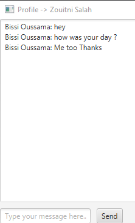

# Activité Pratique d'une application chat avec JavaFx, les sockets, et les threads

Ce dépôt contient la solution de l'activité pratique axée sur une application JavaFX chat . Ce TP fait partie du cours de Java Avancé dirigé par M. Abdelmajid Bousselham.

## Aperçu d'application

### Application `JavaFX`

- **Objectif** : Développer une application de chat en temps réel utilisant JavaFX, les sockets et les threads, permettant la communication entre deux utilisateurs.
- **L'application se compose des éléments suivants :** :
  1. Une classe `SocketThread` Gère l’instance de chaque socket et assure la communication entre les clients et le serveur.
  2. Une classe `ChatServer` Gère le serveur en acceptant plusieurs connexions simultanées et en relayant les messages entre les utilisateurs.
  2. Créer  vue `product-view` Interface graphique permettant l'envoi et la réception de messages.
  3. Créer le controlleur `ChatController` qui Contrôle l'interface utilisateur et répond aux actions des deux utilisateurs.
- **Résultat Attendu** : Chat application JavaFx entre deux Utilisateurs.
- **Execution**: 
   ## Captures d'écran

| Utilisateur 1 | Utilisateur 1 | Serveur |
|---|---|---|
|  |  |  |

 <hr>
 

   
## Comment Exécuter

1. Cloner le dépôt :
   ```bash
   git clone https://github.com/ouss-issib/practical-activity-java-fx.git

2. Naviguer dans le répertoire du dépôt :
   ```bash
   cd practical-activity-java-fx

3. Compiler et exécuter les fichiers Java :
   ```bash
    mvn clean install
    mvn javafx:run


